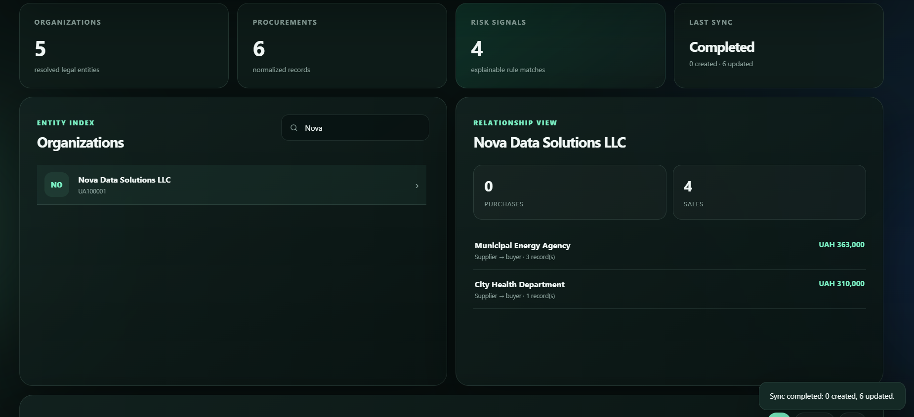
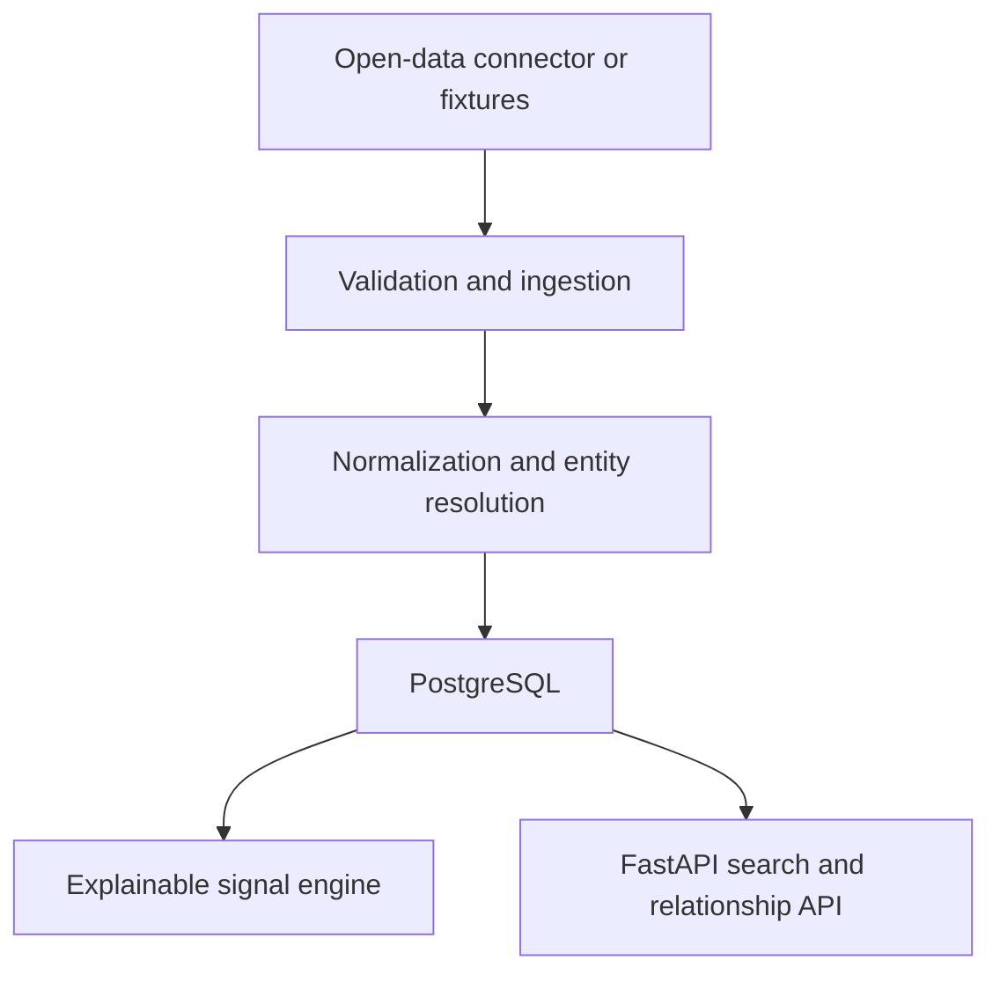

# Open Data Intelligence Pipeline

[](https://github.com/DrevitskyLV/open-data-intelligence-pipeline/actions/workflows/ci.yml)


Independent portfolio project demonstrating idempotent ingestion, entity normalization,
relationship discovery and explainable analytics over public procurement data.



_Entity search, aggregated relationships and a verified idempotent synchronization run._

The committed repository contains synthetic fixtures and no commercial code, client data,
personal data or reverse-engineered company logic. An optional read-only connector to the official
[Prozorro public API](https://prozorro.gov.ua/openprocurement) processes public legal names and
registration identifiers at runtime. It retains award value and tender dates but deliberately
discards contact details.

## Why this project exists

Real integration services must do more than expose CRUD endpoints. They need to validate
untrusted input, resolve repeated entities, survive reprocessing, explain analytical results
and expose observable synchronization state. This project packages those concerns into a
small system that can be reviewed and run locally.



## Current capabilities

- Validated ingestion from deterministic JSON fixtures or the official Prozorro API.
- Async HTTP client with bounded concurrency, pagination, timeout and exponential retry.
- Idempotent upserts keyed by stable external identifiers.
- Organization resolution across differently formatted registration codes.
- Normalized organization names for search and later fuzzy matching.
- Explainable analytical signals:
  - short tender deadline;
  - high-value contract;
  - supplier concentration.
- Aggregated buyer/supplier relationships.
- Interactive dashboard for loading fixtures or live awards, searching entities and inspecting
  relationships.
- Search and filters through a documented REST API.
- PostgreSQL in Docker, SQLite for zero-configuration local development.
- Alembic migrations, pytest suite and GitHub Actions.

## Quick start with Docker

Requirements: Docker with Compose.

```bash
docker compose up --build
```

Open:

- Interactive dashboard: http://localhost:8000/dashboard
- Swagger UI: http://localhost:8000/docs
- Health: http://localhost:8000/api/v1/health

### One-click Windows preview

If Python 3.12 is installed, double-click `start_demo.bat`. The script creates a local virtual
environment on first launch, installs dependencies, starts the API and opens the interactive
dashboard in the default browser. Keep the terminal window open; press `Ctrl+C` to stop it.

Load the demo dataset:

```bash
curl -X POST http://localhost:8000/api/v1/sync-runs \
  -H "Content-Type: application/json" \
  -d '{"source":"fixtures"}'
```

Run the same request again: `records_created` becomes `0`, while the database still contains
six procurements. This demonstrates idempotent reprocessing.

Load up to six recent awarded procurements from the public API:

```bash
curl -X POST http://localhost:8000/api/v1/sync-runs \
  -H "Content-Type: application/json" \
  -d '{"source":"prozorro","limit":6}'
```

The live request is opt-in and requires internet access. It follows Prozorro pagination and scans
recently modified tenders until it finds usable active awards.

## Local development

```bash
python -m venv .venv
source .venv/bin/activate              # Windows: .venv\Scripts\activate
python -m pip install -e ".[dev]"
cp .env.example .env                   # optional; environment variables are read directly
uvicorn open_data_intelligence.main:app --reload
```

The default database is SQLite. For PostgreSQL, set `DATABASE_URL` and run:

```bash
alembic upgrade head
```

## API

| Method | Endpoint | Purpose |
| --- | --- | --- |
| `POST` | `/api/v1/sync-runs` | Ingest fixtures or recent Prozorro awards |
| `GET` | `/api/v1/sync-runs/{id}` | Inspect synchronization status and counters |
| `GET` | `/api/v1/organizations` | Search organizations by name or code |
| `GET` | `/api/v1/organizations/{id}` | View organization summary |
| `GET` | `/api/v1/organizations/{id}/relationships` | Aggregate buyers and suppliers |
| `GET` | `/api/v1/procurements` | List normalized procurements |
| `GET` | `/api/v1/risk-signals` | Filter explainable analytical signals |

## Quality checks

```bash
pytest --cov=open_data_intelligence --cov-report=term-missing
ruff check .
ruff format --check .
mypy src
```

## Design decisions

### Stable identifiers before fuzzy matching

Registration codes are normalized first because deterministic evidence should have priority
over probabilistic name similarity. Fuzzy matching is listed as a later, reviewable layer.

### Explainable signals

Every signal contains a human-readable reason and links back to an organization or procurement.
The project deliberately avoids pretending that deterministic rules are an ML risk score.

### Bounded live connector

The connector reads the descending tender feed, follows `next_page.uri`, fetches tender details
concurrently and maps only active awards. Requests retry HTTP 429 and 5xx responses with
exponential backoff. Deterministic tests use `httpx.MockTransport`, so CI never depends on the
availability or contents of the live API.

### Request-scoped v0.1 ingestion

The first release executes a small bounded dataset inside the request so reviewers can run the
complete flow without operating a queue. Network I/O is asynchronous, but persistence still
finishes before the response. The service boundary and `sync_runs` model are already present;
moving execution to a Redis-backed worker is the first roadmap milestone.

## Repository structure

```text
src/open_data_intelligence/
├── connectors/
│   └── prozorro.py         # Async public API client and source mapping
├── api.py                  # HTTP endpoints and query composition
├── config.py               # Environment-driven configuration
├── db.py                   # SQLAlchemy engine and session lifecycle
├── models.py               # Persistence model
├── schemas.py              # Input and output contracts
└── services/
    ├── ingestion.py        # Validation, entity upsert and idempotency
    ├── normalization.py    # Deterministic organization normalization
    └── signals.py          # Explainable analytical rules
```

See [docs/ROADMAP.md](docs/ROADMAP.md) for deliberately scoped next steps.
Use [docs/INTERVIEW_GUIDE.md](docs/INTERVIEW_GUIDE.md) to prepare the technical explanation and
[docs/GITHUB_SETUP.md](docs/GITHUB_SETUP.md) when publishing the repository.

## Author

Lev Drevytskyi — Python Backend Developer
